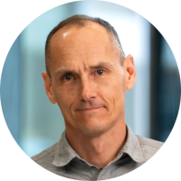

_Mit über zwanzig Jahren Erfahrung in der Softwareentwicklung, 
unterwegs in verschiedensten Branchen und Technologien, 
möchte ich mit diesem Wissen und meiner Leidenschaft einen Unterschied machen._

_Pascal Mengelt, Gründer von Z9nAI_

### Team
Wir möchten Kunden Software Ingenieure anbieten, 
welche ein Projekt von A-Z erfolgreich durchziehen können.

Im Moment bin ich noch alleine unterwegs. 
So wenn du unsere Konzepte spannend findest, freuen wir uns auf einen Austausch.

**Pascal Mengelt**

Gründer & Software Ingenieur

Pascal bringt über 20 Jahre Erfahrung in Software Engineering mit.
architektur, Prozessorchestrierung und domänengetriebenem Design mit. Er ist Autor von _Orchescala_ und treibt die Vision von KI-gestützter Prozessautomatisierung voran.

---

### Kontakt aufnehmen

Interesse an einer Zusammenarbeit oder Fragen zu unseren Services? Wir freuen uns auf deine Nachricht.

📧 [hello@z9n.ai](mailto:hello@z9n.ai)

